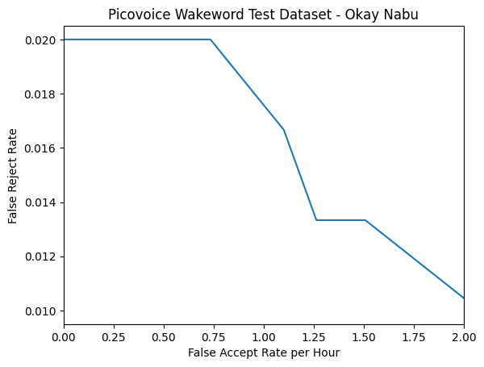
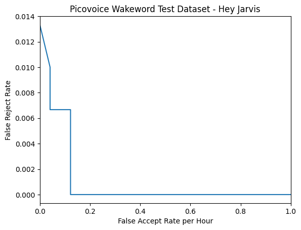
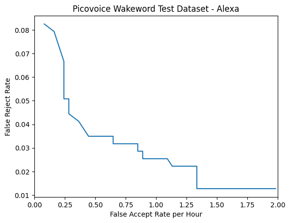

microWakeWord is an open-source wakeword library for detecting custom wake words on low power devices. It produces models that are suitable for using [TensorFlow Lite for Microcontrollers](https://www.tensorflow.org/lite/microcontrollers). The models are suitable for real-world usage with low false accept and false reject rates.

**microWakeword is currently available as an early release. microWakeWord can augment audio, generate features, and train models. It does not include sample generation or an all-in-one training notebook at this time. The training process produces usable models, but it requires much experimentation and tweaking to get really good results.**

## Benchmarks

Benchmarking and comparing wake word models is challenging. It is hard to account for all the different operating environments. [Picovoice](https://github.com/Picovoice/wake-word-benchmark) has provided one benchmark for at least one point of comparison. For a more rigorous false acceptance metric, we also test on the [Dinner Party Corpus](https://www.amazon.science/publications/dipco-dinner-party-corpus) dataset.

### Okay Nabu

The following graph depicts the false-accept/false-reject rate for the "Okay Nabu" model. Note that the test clips used in the benchmark are created with Piper sample generator, not real voice samples.

The default parameters (probablity cutoff of 0.5 and average window size of 10) has a false rejection rate of 2% and 0.122 false accepts per hour with the Picovoice benchmark dataset. There are 0.187 false accepts per hour on the Dinner Party Corpus with these settings.

### Hey Jarvis

The following graph depicts the false-accept/false-reject rate for the "Hey Jarvis" model. Note that the test clips used in the benchmark are created with Piper sample generator, not real voice samples.

The default parameters (probablity cutoff of 0.5 and average window size of 10) has a false rejection rate of 0.67% and 0.081 false accepts per hour with the Picovoice benchmark dataset. There are 0.375 false accepts per hour on the Dinner Party Corpus with these settings.

### Alexa

The following graph depicts the false-accept/false-reject rate for the "Alexa" model. The positive samples are real recordings sources from the Picovoice repository.

The default parameters (probability cutoff of 0.66 and average window size of 10) has a false rejection rate of 3.49% and 0.486 false accepts per hour with the Picovoice benchmark dataset. There are 0.187 false accepts per hour on the Dinner Party Corpus with these settings.

## Detection Process

We detect the wake word in two stages. Raw audio data is processed into 40 features every 20 ms. These features construct a spectrogram. The streaming inference model uses the newest slice of feature data as input and returns a probability that the wake word is said. If the model consistently predicts the wake word over multiple windows, then we predict that the wake word has been said.

The first stage processes the raw monochannel audio data at a sample rate of 16 kHz via the [micro_speech preprocessor](https://github.com/tensorflow/tflite-micro/tree/main/tensorflow/lite/micro/examples/micro_speech). The preprocessor generates 40 features over 30 ms (the window duration) of audio data. The preprocessor generates these features every 20 ms (the stride duration), so the first 10 ms of audio data is part of the previous window. This process is similar to calculating a Mel spectrogram for the audio data, but it is lightweight for devices with limited processing power. See the linked TFLite Micro example for full details on how the audio is processed.

The streaming model performs inferences every 20 ms on the newest audio stride. The model is based on an [inception neural network](https://towardsdatascience.com/a-simple-guide-to-the-versions-of-the-inception-network-7fc52b863202?gi=6bc760f44aef) converted for streaming. Streaming and training the model uses heavily modified open-sourced code from [Google Research](https://github.com/google-research/google-research/tree/master/kws_streaming) found in the paper [Streaming Keyword Spotting on Mobile Devices](https://arxiv.org/pdf/2005.06720.pdf) by Rykabov, Kononenko, Subrahmanya, Visontai, and Laurenzo.

## Model and Training Design Notes

### Inception Based Model
- We apply [SubSpectral Normalization](https://arxiv.org/abs/2103.13620) after the initial convolution layer
- Temporal dilatations for later convolutions greatly improve accuracy; these operations are currently not optimized in the TFLite Micro for Espressif's chip, so by default are not configured
- The model doesn't use a Global Average Pooling layer, but rather a larger Fully Connected layer. This improves accuracy, and it is much faster on ESP32 devices.
- Some wake word phrases may not need as large of a model. Adjusting ``cnn1_filters``, ``cnn2_filters1``, and ``cnn2_filters2`` can increase or decrease the model size and latency.
- All convolutions have no padding. The training process ensures the last layer has features representing exactly ``clip_duration_ms``.

### MixedNet Based Model (new)
- It is based on the paper [MixConv: Mixed Depthwise Convolutional Kernels](https://arxiv.org/abs/1907.09595).
- This architecture is much faster and uses less memory.
- Can produce more accurate models than the Inception based models while using far fewer parameters.
- Hyperparameters can be better optimized.

### Training Process
- We augment the spectrograms in several possible ways during training:
    - [SpecAugment](https://arxiv.org/pdf/1904.08779.pdf) masks time and frequency features
- The best weights are chosen as a two-step process:
    1. The top priority is minimizing a specific metric like the false accepts per hour on ambient background noise first.
    2. If the specified minimization target metric is met, then we maximize a different specified metric like accuracy.
- Validation and test sets are split into two portions:
    1. The ``validation`` and ``testing`` sets include the positive and negative generated samples.
    2. The ``validation_ambient`` and ``testing_ambient`` sets are all negative samples representing real-world background sounds; e.g., music, random household noises, and general speech/conversations.
- Generated spectrograms are stored as [Ragged Mmap](https://github.com/hristo-vrigazov/mmap.ninja/tree/master) folders for quick loading from the disk while training.
- Each feature set is configured with a ``sampling_weight`` and ``penalty_weight``. The ``sampling_weight`` parameter controls oversampling and ``penalty_weight`` controls the weight of incorrect predictions.
- Class weights are also adjustable with the ``positive_class_weight`` and ``negative_class_weight`` parameters. It is useful to increase the ``negative_class_weight`` near the end of the training process to reduce the amount of false accepts.
- We train the model in a non-streaming mode; i.e., it trains on the entire spectrogram. When finished, this is converted to a streaming model that updates every 20 ms.
    - Not padding the convolutions ensures the non-streaming and streaming models have nearly identical prediction behaviors.
    - We estimate the false accepts per hour metric during training by splitting long-duration ambient clips into appropriate-sized spectrograms with a 100 ms stride to simulate the streaming model. This is not a perfect estimate of the streaming model's real-world false accepts per hour, but it is sufficient for determining the best weights.
- We should generate spectrogram features over a longer time period than needed for training the model. The preprocessor model applies PCAN and noise reduction, and generating features over a longer time period results in models that are better to generalize.
- We quantize the streaming models to increase performance on low-power devices. This has a small performance penalty that varies from model to model, but it typically lowers accuracy on the test dataset by around 0.05%.

## Model Training Process

We generate positive and negative samples using [openWakeWord](https://github.com/dscripka/openWakeWord), which relies on [Piper sample generator](https://github.com/rhasspy/piper-sample-generator).

The generated samples are augmented while training to increase variability. There are precomputed spectrogram features for various negative datasets available on [Hugging Face](https://huggingface.co/datasets/kahrendt/microwakeword).

Please see the ``feature_generation.ipynb`` notebook on how to get started with downloading some background datasets and how to augment clips.

Please see the ``training_notebook.ipynb`` notebook to see how a model is trained.

## Acknowledgements

I am very thankful for many people's support to help improve this! Thank you, in particular, to the following individuals and organizations for providing feedback, collaboration, and developmental support:

  - [balloob](https://github.com/balloob)
  - [dscripka](https://github.com/dscripka)
  - [jesserockz](https://github.com/jesserockz)
  - [kbx81](https://github.com/kbx81)
  - [synesthesiam](https://github.com/synesthesiam)
  - [ESPHome](https://github.com/esphome)
  - [Nabu Casa](https://github.com/NabuCasa)